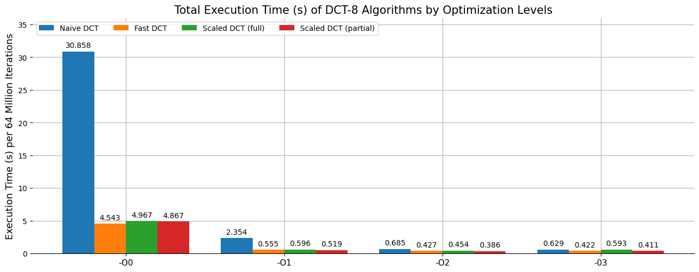

# Fast 8-point DCT & IDCT Algorithms
This repo contains an implementation and derivation of two algorithms for fast DCT/IDCT computations. The second one provides an effective fusion of DCT/IDCT with a prior or subsequent quantization process if there is any. The resulted **speed up**  can be **up to 7 times** in comparison with a naive approach. This project is a part of [JPEG Decoder library](https://github.com/Mr6one/JpegDecoder).



## Motivation
DCT is a widely used transformation technique in signal processing and its 8-point version is an important step in many data compression applications, therefore a variety of algorithms for fast DCT were proposed and two of them are presented here.

## Statement
The 8-point orthogonal DCT & IDCT transformations can be computed with **13 multiplications** and **29 additions**. In comparisson a naive approach requires 64 multiplications and 56 additions. 
NOTE: if we ommit the orthogonality requirement then a scaled transformation by factor of $\sqrt{2}$ can be performed with only **11 multiplications**.

## Code
To reproduce the time complexity follow the next steps
```code
git clone https://github.com/Mr6one/FastDCT.git
cd fast_dct/benchmark
mkdir build && cd build
cmake -DCMAKE_CXX_FLAGS=-O{N} .. && make -j4
./benchmark
```
where {N} is an optimizaton leven from 0 to 3.

## Mathematics
For the algorithm derivation refer to [math.ipynb](math.ipynb).

## References
1. Feig E., Winograd S. Fast algorithms for the discrete cosine transform //IEEE Transactions on Signal processing. – 1992. – Т. 40. – №. 9. – С. 2174-2193.
2. Loeffler C., Ligtenberg A., Moschytz G. S. Algorithm-architecture mapping for custom DSP chips //1988., IEEE International Symposium on Circuits and Systems. – IEEE, 1988. – С. 1953-1956.
3. Loeffler C., Ligtenberg A., Moschytz G. S. Practical fast 1-D DCT algorithms with 11 multiplications //International Conference on Acoustics, Speech, and Signal Processing,. – IEEE, 1989. – С. 988-991.
